<p>
  <a href="https://www.linkedin.com/in/arsalanaliarain"></a>
  <a href="https://sastaticket.pk"></a>
  
</p>

I build the parts of a system that have to be right when everything else is on fire.

Software engineer at [Sastaticket](https://sastaticket.pk), an online travel agency. I work across the stack of a booking platform: flight search and pricing in the backend, booking and payment flows that have to survive retries and duplicate webhooks, and the web and mobile clients on top. Backends in **Django**, **Go** and **Rust**. Interfaces in **Next.js** and **Flutter**. Machine learning where it earns its place, with evals rather than vibes.

```text
$ cat principles.md
- correct first, then fast
- assume the network lies
- make it explainable
- boring where it matters
- evals over vibes
- write it down
```

## Stack, with honest depth

Four blocks means I run it in production and can debug it at 3 a.m. One block means I have used it and would need a week to be dangerous.

| Backend | Client | Data | Ops & AI |
|---|---|---|---|
| Python / Django `████` | TypeScript `████` | PostgreSQL `████` | OpenTelemetry / Grafana `████` |
| Go `████` | Next.js / React `████` | Redis `████` | CI/CD · GitHub Actions `████` |
| Node.js `███` | Flutter / Dart `███` | Kafka / RabbitMQ `███` | Docker / Kubernetes `███` |
| Rust `███` | CSS · design systems `███` | pgvector `███` | AWS `███` |
| gRPC / REST `████` | Canvas / WebGL `██` | ClickHouse `██` | Retrieval · evals · Claude API `███` |

<p>
  
</p>

## Currently

- Fanning flight search out to a dozen suppliers with a hard latency budget and hedged retries, so one slow airline never slows the customer.
- Making booking state machines idempotent end to end, so a payment webhook arriving twice is a no-op instead of a second ticket.
- Building retrieval over fare rules and airline policies, gated by an eval set that blocks regressions before they ship.
- Using Claude Code daily for the boring parts, and writing down what works.

## Activity

<p>
  
  
</p>


## Reach me

LinkedIn is the fastest way: [linkedin.com/in/arsalanaliarain](https://www.linkedin.com/in/arsalanaliarain). If you are building something that has to stay up, I would like to hear about it.
